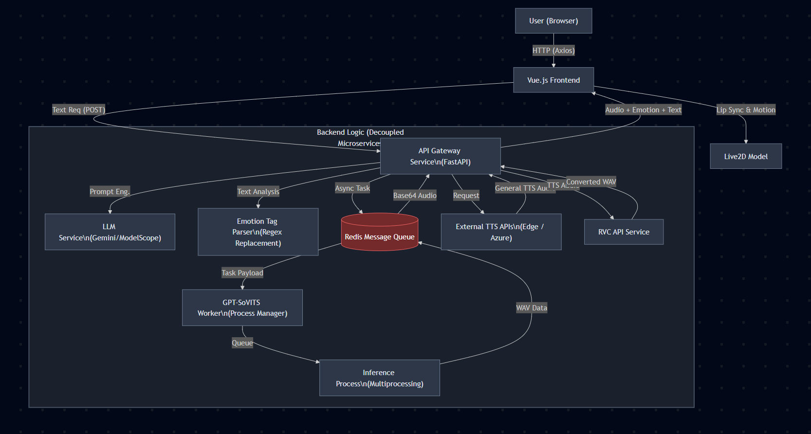

<div align="center">
  <a href="#jp">🇯🇵 日本語</a> | <a href="#en">🇺🇸 English</a>
</div>

<span id="jp"></span>

# AI/Live2D Character Chat - GPT-SoVITS Worker (System Main Docs)

## プロジェクト構成について (Project Structure)

本リポジトリは、「AI/Live2D キャラクターチャットアプリケーション」における **GPT-SoVITS音声合成（GPUワーカー）** を担当するプロジェクトであり、 **システム全体のメインドキュメント** を兼ねています。

今後の負荷増や並行処理を見据え、システム全体は役割ごとに **4つのマイクロサービス（独立したリポジトリ）** へ分割・解耦（Decoupling）されています：

1.  **Backend - GSV Service: 本リポジトリ (Main Docs & GPT-SoVITS Inference)**
    *   役割: Redisキューを監視し、GPUリソースを消費する重い音声合成タスク（GPT-SoVITS）を非同期で実行。
2.  [Backend - API Gateway](https://github.com/3dayspark/Live2DChat_API_Gateway)
    *   役割: クライアントリクエストの受付、LLM連携、タスクのRedisへのプッシュ、外部TTSの呼び出し等を担うCPUバウンドなAPIサーバー。
3.  [Frontend - Live2D & Vue.js](https://github.com/3dayspark/Live2DChat_Vue)
    *   役割: Live2Dモデルの描画、チャットUI、リアルタイム・リップシンク制御。
4.  [Microservice - RVC Service](https://github.com/3dayspark/Live2DChat_RVC_Service)
    *   役割: 外部TTS音声の声質変換 (RVC) を行う独立したGPUマイクロサービス。

## 概要 (Overview)
LLM（大規模言語モデル）とLive2D、そして最新の音声合成技術（GPT-SoVITS, RVC）を統合した、リアルタイム・ウェブ対話アプリケーションです。単なるチャットボットではなく、「感情表現」と「音声の多様な合成方式」に焦点を当てています。

## システムアーキテクチャ (System Architecture)

現在のシステムは、将来的なクラウド環境（AWS等）での **独立したスケーリング（Independent Scaling）** を可能にするアーキテクチャを採用しています。



*   **独立拡張性:** 軽量なHTTPリクエストを処理する「API Gateway（CPU）」と、重い推論を行う「GSV Worker（GPU）」を分離したことで、トラフィック増加時にはAPI Gatewayのみをスケールアウトし、音声合成キューが溜まった時のみGSV Workerをスケールアウトさせることが可能です。

### データフローと連携メカニズム
1.  **Redisを介したGatewayとGSV Workerの制御:**
    *   API GatewayはLLMからテキストを受け取ると、タスクIDを発行し、タスクペイロードをRedisのリスト（`queue:audio:global`）に `rpush` します。
    *   GSV Workerは常時 `brpop` でキューを監視しており、タスクを取得して音声合成を実行後、結果（Base64音声データ）をRedisのKey-Valueとして `set` し、Gatewayがそれを取得してフロントエンドへ返します。
2.  **外部TTSとRVCサービスの連携:**
    *   「TTS+RVCモード」が選択された場合、Gatewayはまず外部API（Gemini/Edge/Azure）にテキストを送信して汎用音声を取得します。
    *   その後、Gatewayはその音声データをBase64エンコードし、独立した `RVC Service` へHTTP POSTリクエストを送信。キャラクターの声に声質変換された音声を受け取ります。

## 主要機能 (Key Features)

*   **柔軟なマルチLLM推論モデル:**
    *   Gemini API、またはModelScope (Qwen等) などの複数のLLMをワンクリックで切り替えて対話生成が可能。
*   **マルチ音声合成パイプライン (Multi-TTS Pipeline):** シナリオに応じて以下の音声合成方式を切り替え可能です。
    *   **GPT-SoVITS:** 少量のデータで高品質・高感情なキャラクター音声合成。
    *   **外部TTS + RVC:** Gemini TTS / EdgeTTS / Azure TTSで生成した音声を、RVCサービス経由でキャラクターの声質へリアルタイム変換。長文や高速な応答が必要な場面に最適化。
*   **シングル / デュアルキャラクターモード:**
    *   ユーザーと1対1で会話する通常のモードに加え、2体のAIキャラクター同士が会話する様子を観察できる「デュアルキャラクターモード」を搭載。
*   **フロントエンドでのリアルタイム・リップシンク:**
    *   サーバーサイドでリップシンクデータを事前計算するのではなく、フロントエンドの `Web Audio API` (`AnalyserNode`) を使用して音声の周波数データをリアルタイム解析。音量に応じてLive2Dの口の開閉を動的に制御することで、サーバー負荷を大幅に削減しています。

## 技術スタック (Tech Stack)

### Backend (GSV Service & API Gateway)
*   **Framework:** FastAPI (Asynchronous I/O)
*   **Message Broker:** Redis (Queue management & Pub/Sub for decoupling)
*   **LLM Integration:** Gemini API, ModelScope (Qwen)
*   **Audio Synthesis:** GPT-SoVITS (PyTorch)
*   **Process Management:** Python `multiprocessing` (with threading Locks for GPU memory safety)

### Frontend (Vue.js) & Microservice (RVC)
*   **Frontend:** Vue 3 (Composition API), Vite, TypeScript, PixiJS, Live2D Cubism SDK
*   **Frontend Audio:** Web Audio API (Real-time volume analysis)
*   **RVC Microservice:** FastAPI, Retrieval-based Voice Conversion (RVC), PyTorch

## 最新のアップデート履歴 (Recent Update Log)

旧バージョン（モノリス設計）で掲げていた展望に基づき、以下の大幅なアーキテクチャ刷新を行いました。

*   **サービスの完全な疎結合化 (Service Decoupling):**
    *   API GatewayとGSV Workerを別リポジトリ・別プロセスに分割しました。
*   **Redisメッセージキューの導入:**
    *   高負荷時のトラフィック制御のためにRedisを導入。これにより、将来的にリソースが許すタイミングで「キャラクターごとに専用のWorkerを割り当て、モデルの切り替えコストをゼロにする（Zero Cold Start）」という大規模構成への移行準備が整いました。
*   **感情分析ロジックの最適化:**
    *   以前はローカルに重い感情分析モデル（BERT等）を配置していましたが、これを撤廃し、LLMのプロンプトエンジニアリングによって出力テキスト内に `[emotion:happiness]` のようなタグを含めさせる方式に変更しました。これにより、推論の質を落とすことなくデプロイ時の複雑さとリソース消費を大幅に削減しました。

## 環境構築と実行方法 (Setup Instructions for GSV Worker)

GSV Workerプロジェクトをローカルでセットアップするための基本手順です。

1. **PyTorchのインストール:**
   ご自身のCUDA環境（例: cu118）とPythonバージョンに合わせたPyTorchを手動でインストールします。
   ```bash
   pip install torch torchvision torchaudio --index-url https://download.pytorch.org/whl/cu118
   ```
2. **依存パッケージのインストール:**
   ```bash
   pip install -r requirements.txt
   ```
3. **OpenJTalk辞書の配置（エラー回避用）:**
   GSVの初回実行時、日本語合成用の `open_jtalk` 辞書の自動ダウンロードが失敗してエラーになる場合があります。その場合は以下を手動で行ってください。
   *[open_jtalk_dic_utf_8-1.11.tar.gz](https://github.com/r9y9/open_jtalk/releases/download/v1.11.1/open_jtalk_dic_utf_8-1.11.tar.gz) をダウンロードして解圧。
   * 解圧したフォルダ内のデータを、プロジェクトの仮想環境内の以下のパスに配置してください：
     `仮想環境ルート\Lib\site-packages\pyopenjtalk\open_jtalk_dic_utf_8-1.11\`

## セットアップに関する注意 (Note on Setup & Execution)

本リポジトリはポートフォリオとして公開しており、ソースコードの閲覧を主目的としています。
商用または著作権のあるLive2Dモデルデータ、大容量の学習済み重みファイルなどは `.gitignore` により除外されています。

### 必要なファイル構成 (Missing Files Structure)
ローカルで完全に実行する場合、リポジトリ内に以下のファイルやディレクトリ（一例）を適切に配置する必要があります：

*   `./GPT_SoVITS/pretrained_models/` ... GPT-SoVITSの事前学習済みベースモデル
*   `./reference_audio/` ... 各キャラクターの推論用参照音声およびモデルデータ
*   `./public/models/` ... フロントエンド側のLive2Dモデルデータ

---

<span id="en"></span>

# AI/Live2D Character Chat - GPT-SoVITS Worker (System Main Docs)

## Project Structure

This repository is the **GPT-SoVITS Worker (GPU Inference)** for the "AI/Live2D Character Chat Application" and serves as the **System's Main Documentation**.

To accommodate future scalability and concurrent processing, the entire system has been decoupled into **4 independent microservices**:

1.  **Backend - GSV Service: This Repository (Main Docs & GPT-SoVITS Inference)**
    *   Role: Monitors the Redis queue and asynchronously executes heavy audio synthesis tasks (GPU-bound).
2.  [Backend - API Gateway](https://github.com/3dayspark/Live2DChat_API_Gateway)
    *   Role: A CPU-bound API server handling client requests, LLM interactions, pushing tasks to Redis, and calling external TTS APIs.
3.[Frontend - Live2D & Vue.js](https://github.com/3dayspark/Live2DChat_Vue)
    *   Role: Rendering Live2D models, Chat UI, and Real-time Lip-sync control.
4.  [Microservice - RVC Service](https://github.com/3dayspark/Live2DChat_RVC_Service)
    *   Role: An independent GPU microservice for Real-time Voice Conversion (RVC).

## Overview
A real-time web dialogue application integrating Large Language Models (LLM), Live2D, and advanced speech synthesis technologies (GPT-SoVITS, RVC). It focuses heavily on "Emotional Expression" and "Diverse Audio Synthesis Methods."

## System Architecture

The current architecture is designed to enable **Independent Scaling** in cloud environments (like AWS).


*   **Independent Scalability:** By decoupling the lightweight "API Gateway (CPU)" from the heavy "GSV Worker (GPU)", the system can scale the API Gateway horizontally during high web traffic, and scale the GSV Worker only when the audio generation queue builds up.

### Data Flow & Control Mechanisms
1.  **Gateway & GSV Worker via Redis:**
    *   Upon receiving text from the LLM, the API Gateway generates a Task ID and pushes (`rpush`) the payload to a Redis list (`queue:audio:global`).
    *   The GSV Worker constantly polls (`brpop`) the queue. After synthesizing the audio, it sets (`set`) the Base64 audio result back to Redis, which the Gateway retrieves and returns to the frontend.
2.  **External TTS & RVC Integration:**
    *   If the "TTS+RVC Mode" is selected, the Gateway calls an external API (Gemini/Edge/Azure) to get generic speech audio.
    *   The Gateway then sends this audio via an HTTP POST request to the isolated `RVC Service`, which converts and returns the target character's voice.

## Key Features

*   **Multi-LLM Support:** Easily switch between different inference models such as Gemini API and ModelScope (e.g., Qwen).
*   **Multi-TTS Pipeline:** 
    *   **GPT-SoVITS:** High-quality, emotional character voice synthesis.
    *   **External TTS + RVC:** Real-time voice conversion mapping outputs from Gemini/Edge/Azure TTS into the character's voice via the RVC service.
*   **Single / Dual Character Modes:** Switch between a standard 1-on-1 chat and an autonomous "Dual Character Mode" where two AI characters converse with each other.
*   **Real-time Frontend Lip-sync:** 
    *   The frontend uses the `Web Audio API` (`AnalyserNode`) to analyze audio frequencies in real-time, dynamically adjusting the Live2D mouth parameters. This drastically reduces server computation load.

## Tech Stack

### Backend (GSV Service & API Gateway)
*   **Framework:** FastAPI (Asynchronous I/O)
*   **Message Broker:** Redis
*   **LLM Integration:** Gemini API, ModelScope (Qwen)
*   **Audio Synthesis:** GPT-SoVITS (PyTorch)
*   **Process Management:** Python `multiprocessing` with threading Locks

### Frontend (Vue.js) & Microservice (RVC)
*   **Frontend:** Vue 3 (Composition API), Vite, TypeScript, PixiJS, Live2D Cubism SDK
*   **Frontend Audio:** Web Audio API (Real-time volume analysis)
*   **RVC Microservice:** FastAPI, Retrieval-based Voice Conversion (RVC), PyTorch

## Recent Update Log

*   **Service Decoupling:** Split the API Gateway and GSV Worker into separate repositories and processes.
*   **Redis Message Queue Integration:** Introduced Redis to handle high-load traffic safely. This lays the groundwork for a future "Zero Cold Start" architecture.
*   **Optimized Emotion Detection:** Removed the heavy, locally-hosted NLP emotion detection model (e.g., BERT). Instead, we now use LLM prompt engineering to output emotion tags (e.g., `[emotion:happiness]`) inside the text generation, saving VRAM and compute resources.

## Note on Setup & Execution

This repository is published as a portfolio primarily for viewing source code. Copyrighted Live2D model data and large pre-trained weight files are excluded via `.gitignore`.

### Missing Files Structure
To run locally, you must place appropriate files in the repository, such as:
*   `./GPT_SoVITS/pretrained_models/` ... Pre-trained base models for GPT-SoVITS.
*   `./reference_audio/` ... Inference audio references and model data for each character.
*   `./public/models/` ... Live2D model data for the frontend.

